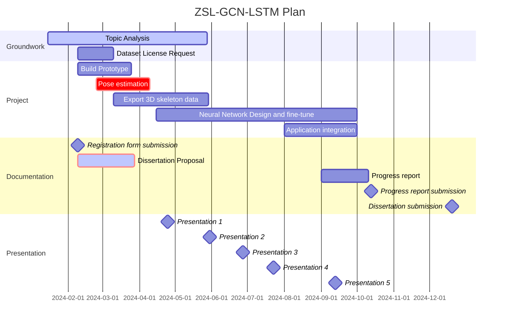
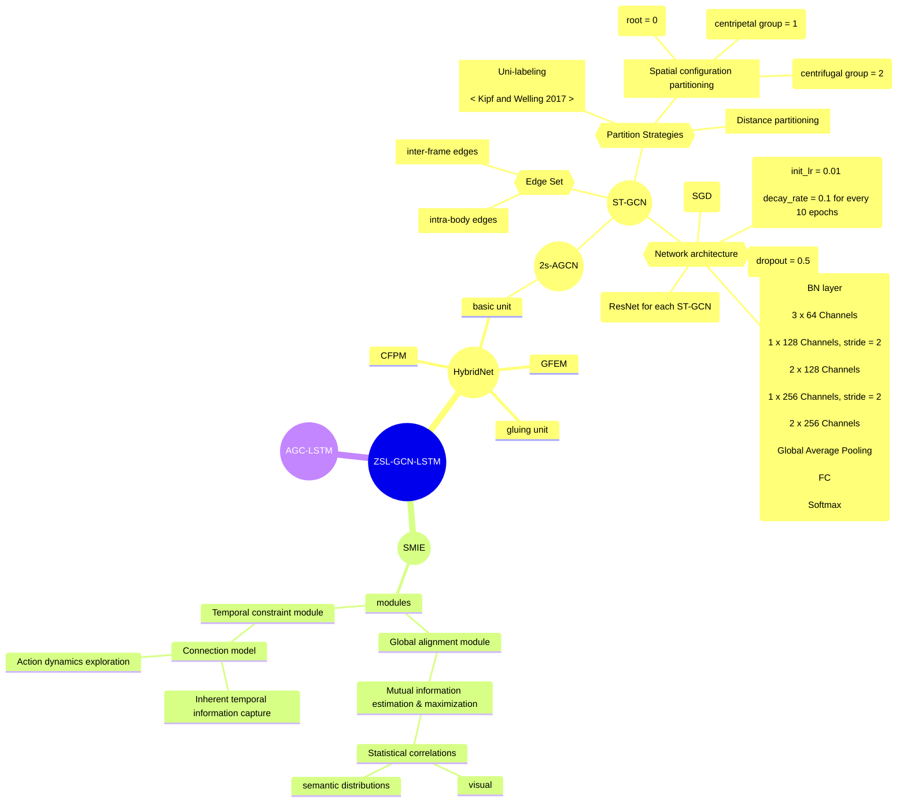

## Zero-shot learning for skeleton-base action recognition using GCN-LSTM model (ZSL-GCN-LSTM)

### Aim and Objectives
This project aims to develop an application featureing human action recognition. Users are allowed to activate assigned commands when they perform specific actions.

There are four objectives in this project:
1. Build a prototype to simulate a real working environment 
    * Stream camera RGB video to PC 
2. Pre-process raw recordings and datasets
    * Body 3D pose reconstruction and estimation using existing models (e.g. OpenPose).
    * Requst [NTU RGB+D](https://rose1.ntu.edu.sg/dataset/actionRecognition/) dataset license
    * Export 3D skeleton data 
3. Design neural network model and tune hyperparameters
    * Design ZSL-GCN-LSTM neural network architecture
    * Hyperparameter optimization
    * Save model
4. Integrate model and application
    * Embed model into application
    * Integration testing and performance evaluation

### Project Plan
The practical work is planned to start at the mid of February 2024 and is expected to be completed in two to three semesters.
1. Build Prototype \
  A platform dedicated to outputting native camera RGB images and visualizing human body skeleton will be built initially. 45 days are required to build a cross-platform application. The real-time pose detection window is to be added later in this stage.
2. Pose Estimation and export 3D skeleton data \
  This study is based on skeleton-based human action recognition. Two approaches are taken to obtain native kinematic model. One approach is to use an algorithm to convert a 2D image into 3D object by estimating an additional Z-dimension to the prediction. Installing required libraries and configuring existing models for pose estimation and skeleton reconstruction can acheive good performance with less time. The algorithm can be referred to reference paper. The other is to use benchmark datasets that contain 3D human skeletal data directly. [NTU RGB+D](https://rose1.ntu.edu.sg/dataset/actionRecognition/) is a large-scale dataset specifically designed for human action recognition that contains 3D skeletal data. In this project, hybrid mode is taken. The content of the datasets will first be fed into the neural network model.
3. Design neural network model and tune hyperparameters \
  Due to the strong correlation between the joints of the human body, the structure of the human body skeleton can be regarded as a graph. Joints as vertexes and their natural connections in the human body as edges. In this study, long-short term memory (RNN-based) will be used to learn spatial and temporal features. \
  Zero-shot learning aims to recognize objects whose instances may not have been seen during training. ZSL method can help us solve the problem that similar actions are easily predict wrongly. It is essential to replace action classes to attributes, which requires time and careful consideration.\
  This section is expected to start at the end of the 2023/2024 spring semester and will have a duration of up to 6 months, with the possibility of extension.
4. Application Integration \
  Integrate saved model with application. Enable human action recognition. It is planned to be carried out from the beginning of August to the end of September. The application development time needs to be determined according to the actual situation.
5. Flextime \
  Time for reporting, collecting statistics or continuing doing incomplete sections.

### MindMap

### Reference
[1] H.-C. Nguyen, T.-H. Nguyen, R. Scherer, and V.-H. Le, “Deep Learning for Human Activity Recognition on 3D Human Skeleton: Survey and Comparative Study,” Sensors (Basel), vol. 23, no. 11, p. 5121, May 2023, doi: 10.3390/s23115121. \
[2] C. Si, W. Chen, W. Wang, L. Wang, and T. Tan, “An Attention Enhanced Graph Convolutional LSTM Network for Skeleton-Based Action Recognition,” in 2019 IEEE/CVF Conference on Computer Vision and Pattern Recognition (CVPR), Long Beach, CA, USA: IEEE, Jun. 2019, pp. 1227–1236. doi: 10.1109/CVPR.2019.00132. \
[3] Y. Xian, C. H. Lampert, B. Schiele, and Z. Akata, “Zero-Shot Learning—A Comprehensive Evaluation of the Good, the Bad and the Ugly,” IEEE Trans. Pattern Anal. Mach. Intell., vol. 41, no. 9, pp. 2251–2265, Sep. 2019, doi: 10.1109/TPAMI.2018.2857768. \
[4] C. H. Lampert, H. Nickisch, and S. Harmeling, “Attribute-Based Classification for Zero-Shot Visual Object Categorization,” IEEE Transactions on Pattern Analysis and Machine Intelligence, vol. 36, no. 3, pp. 453–465, Mar. 2014, doi: 10.1109/TPAMI.2013.140. \
[5] T. N. Kipf and M. Welling, “Semi-Supervised Classification with Graph Convolutional Networks.” arXiv, Feb. 22, 2017. Accessed: Jan. 31, 2024. [Online]. Available: http://arxiv.org/abs/1609.02907